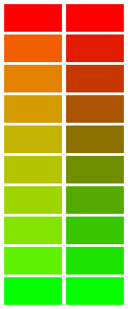

# Perceptive Color Blender

https://parasyte.github.io/perceptive-color-blender

This little web app will generate midpoints in a gradient using a perceptive blending method based on work by [Ebner and Fairchild](https://scholarworks.rit.edu/theses/2858/). This method is "gamma correct" in the sense that blending between pure red and pure green produces bright yellow toward the center of the gradient, instead of a dark yellow produced by naive blending methods.

The example below shows the perceptive blend (this method) on the left, and the naive method (linear interpolation in sRGB space) on the right.

